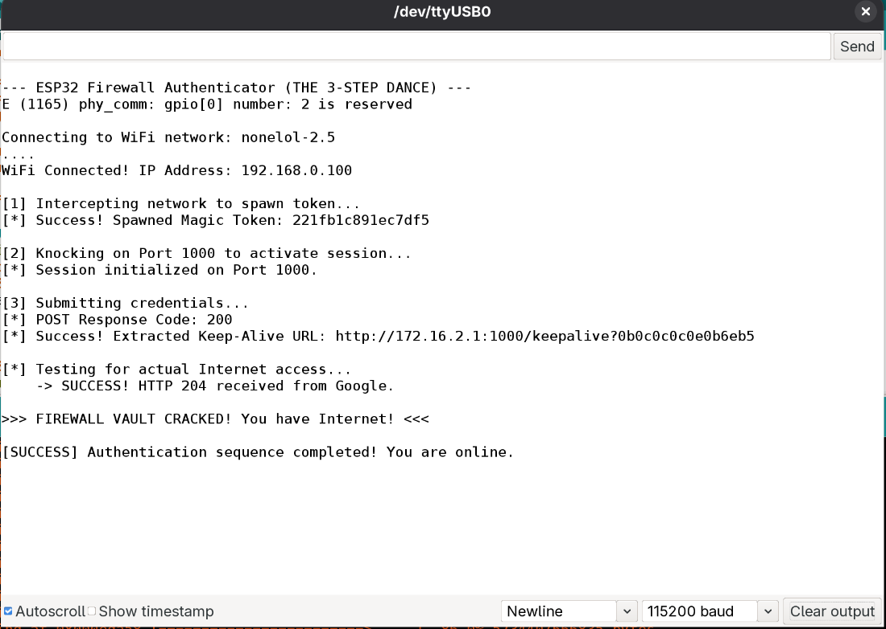

# Chandigarh University Firewall Automatic Bypass
> **Important Info** \> This script does required a active univeristy UID to work, this isnt an script that removes the firewall rather it removes the need to re-authenticate multiple times by using a esp32.
> 
A lightweight, automated C++ solution for maintaining persistent network connectivity on Univeristy firewall that utilize captive portal authentication.

The application implements a stateful HTTP handshake to bypass Cross-Site Request Forgery (CSRF) protections and session-timeout constraints typically found in university or corporate environments.

# Installation & Deployment

#### 1. Hardware Preparation
* **Device**: ESP32 Development Board (WROOM-32, NodeMCU, etc.).

#### 2. Software Requirements
* **Arduino IDE**: Version 2.0 or higher recommended.
* **ESP32 Board Package**: Ensure `esp32` by Expressif Systems is installed via the Boards Manager (Version 3.0+ suggested).
* **Required Libraries**: 
    * `WiFi.h` (Built-in) 
    * `HTTPClient.h` (Built-in) 

#### 3. Configuration & Flashing (most important)
* **Clone the Repository**
     ```bash
     git clone https://github.com/kashbix/void-player.git
     cd void-player
     ```

* **Credentials**: Open finalesp32.ino file and update the `ssid`, `wifi_password`, `uid`, and `password` variables in the  present into the top CONFIGURATION section

* **Upload Settings**:
    * **Board**: "DOIT ESP32 DEVKIT V1" (or your specific model usually present at the back or on the processor).
    * **Baud Rate**: `115200` (tools>upload speed)
* **Flash**: Click the **Upload** button. If you encounter a `Device or resource busy` error, ensure all Serial Monitors are closed before retrying.

#### 4. Verification
* Open the **Serial Monitor**(Ctrl+M) at `115200` baud.
* Watch for the 3-STEP sequence:
    1.  **Intercept**: Confirms a successful "magic" token grab. 
    2.  **Activation**: Confirms Port 1000 has initialized your session. 
    3.  **POST**: Confirms credentials were accepted and the Keep-Alive URL was scraped. 
* Final confirmation is indicated by the **"FIREWALL VAULT CRACKED"** message once the Google Truth Test passes. 
* You will something like this: 

#### 5. Headless Deployment
Once verified, the ESP32 no longer requires a computer connection.
* Power the device using any standard 5V USB wall adapter.
* The script will automatically execute the authentication sequence upon boot.
* If the session expires or power is toggled, the self-healing logic will re-authenticate without manual intervention. 

### 6. Status Monitoring (Onboard LED)

To make the ESP32 a truly "set and forget" headless device, you can use the built-in **LED_BUILTIN** (usually GPIO 2) to get visual feedback on the connection status without needing a serial monitor.

**LED Signal Key:**
* **Rapid Blinking**: Attempting to connect to the local Wi-Fi AP. 
* **Solid Light**: Successfully authenticated and Internet access verified. 
* **Single Pulse**: Heartbeat sent and acknowledged by the firewall. 
* **Slow Blinking**: Connection lost; re-authentication sequence in progress. 


### 7. Troubleshooting

If the deployment fails, check the following common environmental factors:

* **Power Stability**: Ensure the USB power supply provides at least **500mA**. The ESP32 draws significant current during the Wi-Fi TX bursts required for the authentication POST request. 
* **Password Change**: Sometimes the firewall request you to change the password, so it directs you to cuims.cuchd.in, in that case do change the password and make upadate in the file.


# License

This project is open-source and available under the MIT License. See the LICENSE file for further details.
